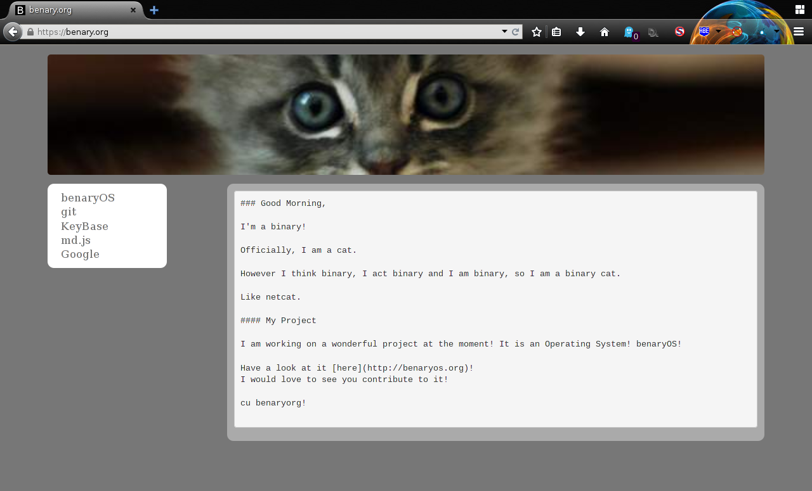
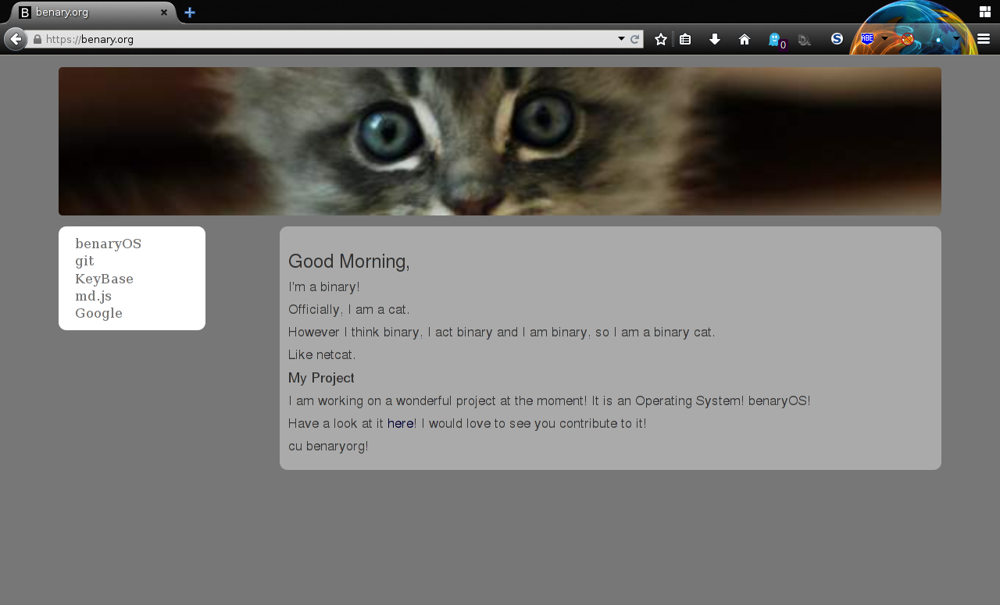

# What is this Website?

This website is a demonstration of [_md.js_](https://github.com/benaryorg/md.js) and
consists of some JavaScript a line of PHP and Markdown.

# What makes it so great?

* create HTML sites using markdown
* create only parts in markdown
* make the website be still readable (plain markdown) without javascript
* the website will be usable with curl/wget
* because of the nature of javascript, you can use whatever backend you like

# Using it

1. write some HTML code to build your website
2. include the JS files
3. write a `pre` tag and set it's class to _mdconv_
4. set the tags content to some Markdown content
5. enjoy

## Files

You need pagedown and md.js.

The files are included in the example, just wget them if you are lazy.

## Examples

### This

This website is available here: [index.php](index.txt) and [index.md](index.md).

### Pictures

Some pictures to show the look with and without JavaScript:

## AJAX

It is possible to use AJAX, but you will have to call `loadMarkdown()` after
inserting all pre tags.
Also, you will notice that the complete pre tag with all it's ids, classes and
other attributes is replaced by a _div_, so take care of that.
But as the goal of this was, to make a website readable without JS, AJAX would
be a waste of my time.

# License

As usual, MIT license.

